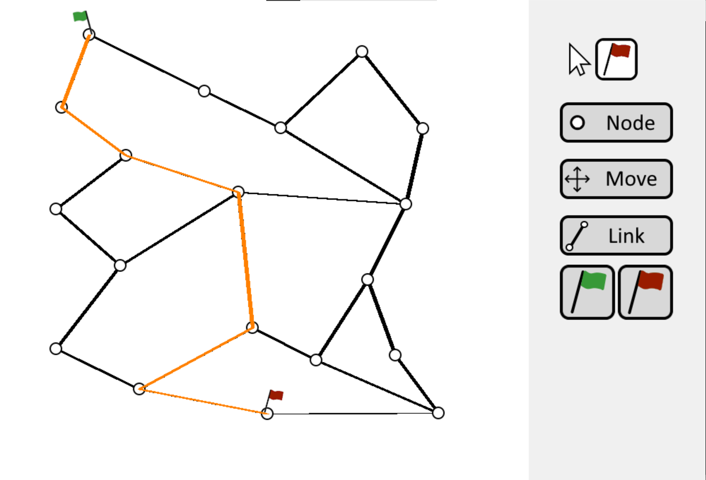
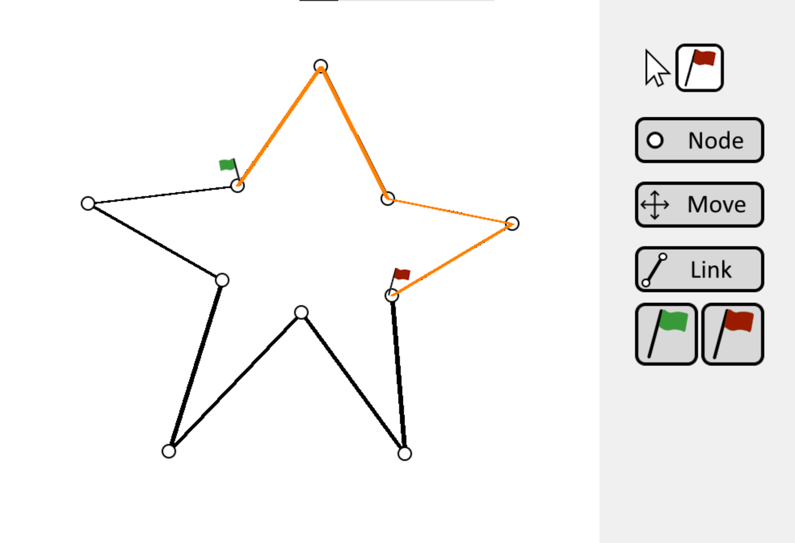
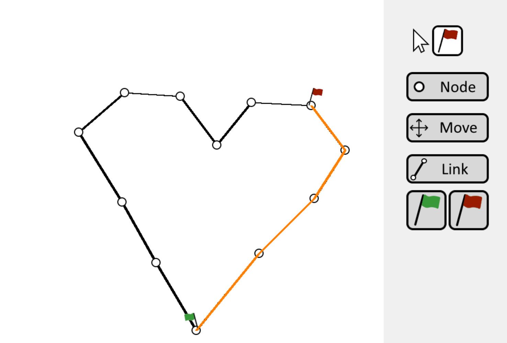
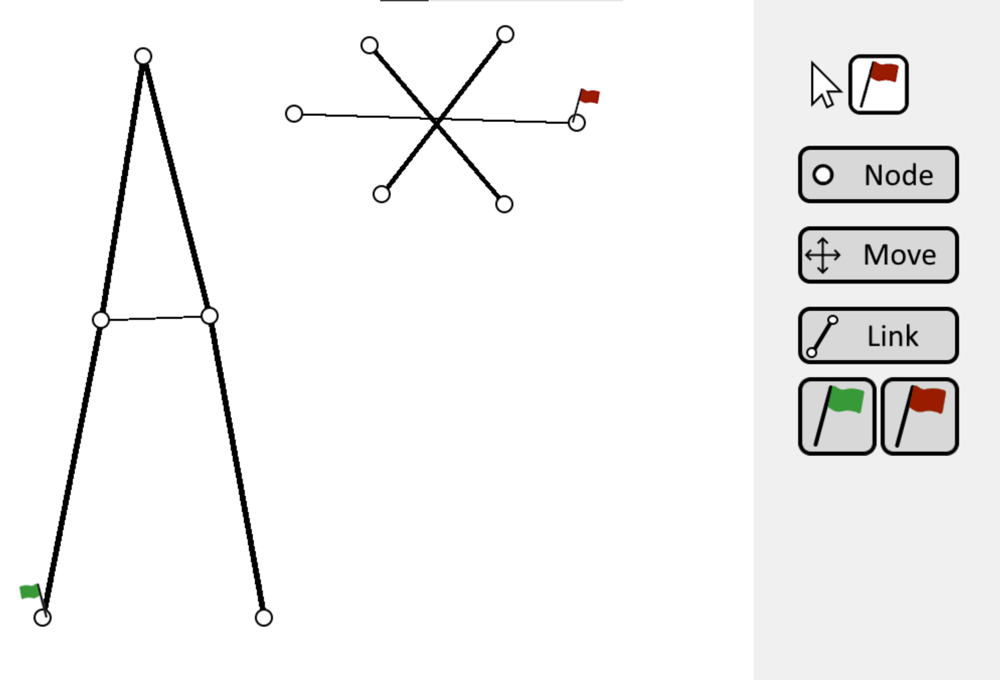

# A\* Pathfinding in C with SDL2

This project is a **C** implementation of the **A\* (A-star)** pathfinding algorithm using **SDL2** for graphical visualization. The program showcases how A\* can be used to find the shortest path between nodes on a grid or graph in a visually interactive way.

## Table of Contents

- [Description](#description)
- [Features](#features)
- [Requirements](#requirements)
- [Build and Run](#build-and-run)
- [Screenshots](#screenshots)
- [Usage](#usage)
- [Contribution](#contribution)
- [License](#license)
- [Cloning the Repository](#cloning-the-repository)

## Description

A\* is a popular pathfinding algorithm used in many applications, such as games and navigation systems, because of its efficiency and optimality under certain conditions. This project demonstrates a minimal yet functional approach to implementing A\* in **pure C**, while using **SDL2** for the graphical rendering of nodes, edges, and paths.

## Features

- **Pure C Implementation**: No C++ features—just standard C.
- **SDL2 Rendering**: Visualize nodes, connections, and the path discovered by A\*.
- **Interactive Interface**: Move or create nodes, link them, and run the pathfinding algorithm in real time.

## Requirements

- **CMake** (for configuring and generating build files).
- **SDL2** (and SDL2 development headers) for rendering.
- A **C compiler** that supports C99 or later.

## Build and Run

Follow these steps to compile and run the project. You can copy and paste the following commands into your terminal:

```bash
# Clone the repository (if you haven't already)
git clone https://github.com/YourUsername/AStar_C_SDL2.git

# Navigate to the project directory
cd AStar_C_SDL2

# Create a build directory and navigate into it
mkdir build
cd build

# Generate the build files using CMake
cmake ..

# Compile the project
make

# Run the executable (the name may vary if you changed it in your CMakeLists.txt)
./AStar
```
## Screenshots
Below are some example screenshots of the project in action:




